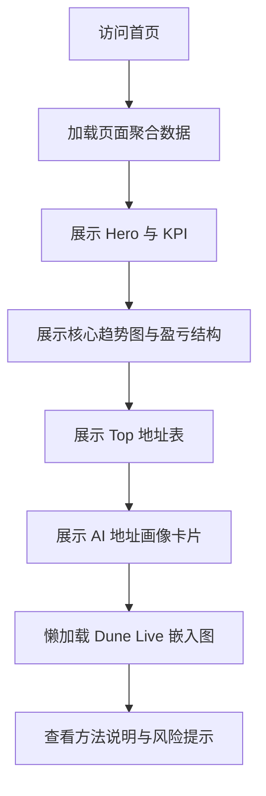

## 1. 产品概述

本产品是一个围绕 FET 的链上聪明钱研究展示页，用于将现有特征层结果、地址画像结果与 Dune 可视化整合成一个可公开演示的单页作品。

* 目标用户包括面试官、研究协作者和项目维护者，重点展示链上研究方法论、指标体系和 AI 地址画像能力。

* 第一阶段追求可复用、可演示、可扩展，不追求多币、多页和复杂交互。

## 2. 核心功能

### 2.1 用户角色

本阶段不区分登录角色，默认所有访问者都只能只读浏览页面内容。

### 2.2 功能模块

1. **FET 展示首页**：Token 身份区、KPI 指标区、核心图表区、Top 地址区、地址画像区、Dune Live 区、方法说明区。
2. **系统状态反馈**：加载态、空态、错误态、数据过期提示。

### 2.3 页面详情

| 页面名称     | 模块名称        | 功能描述                                 |
| -------- | ----------- | ------------------------------------ |
| FET 展示首页 | Hero 身份区    | 展示 FET 名称、链、合约、更新时间、研究结论摘要与风险提示      |
| FET 展示首页 | KPI 指标区     | 展示当前价格、候选地址数、净流入、平均成本、浮盈占比、Top10 集中度 |
| FET 展示首页 | 核心趋势图区      | 展示价格走势、净流入走势、价格与平均成本对比               |
| FET 展示首页 | 盈亏结构区       | 展示 PnL bucket 分布，帮助解释收益结构            |
| FET 展示首页 | Top 地址区     | 展示重点地址的仓位、成本、收益和活跃特征                 |
| FET 展示首页 | 地址画像区       | 展示结构化地址画像卡片，包括标签、摘要和风险提示             |
| FET 展示首页 | Dune Live 区 | 嵌入 1 到 2 个 Dune live 图表，作为研究证明层      |
| FET 展示首页 | 方法说明区       | 解释研究链路、数据来源、AI 输出边界与风险说明             |
| FET 展示首页 | 状态提示模块      | 在模块级展示 loading、empty、error、stale 状态  |

## 3. 核心流程

访问者打开首页后，先看到 FET 最新研究摘要和关键指标，再查看趋势图和收益结构，随后下钻到 Top 地址与 AI 地址画像，最后在 Dune Live 区查看外部可视化证明，并通过方法说明理解整套研究链路。

## 4. 用户界面设计

### 4.1 设计风格

* 主色：深石墨黑背景搭配蓝青色强调，少量琥珀色用于风险提示

* 按钮风格：圆角中等、低饱和高对比、强调按钮带轻微发光边框

* 字体：标题使用具有科技感的展示字体，正文使用易读的现代无衬线字体

* 布局风格：桌面优先、卡片式分区、上下叙事流，首屏信息密度高但结构清晰

* 图标风格建议：线性图标、极简符号，不使用卡通或夸张 emoji

### 4.2 页面设计概览

| 页面名称     | 模块名称        | UI 元素                        |
| -------- | ----------- | ---------------------------- |
| FET 展示首页 | Hero 身份区    | 大标题、Token 标识、更新时间、结论摘要、风险标签  |
| FET 展示首页 | KPI 指标区     | 6 张指标卡片、数值强调、辅助说明、轻动效        |
| FET 展示首页 | 核心趋势图区      | 双轴或双序列折线图、图例、时间选择提示          |
| FET 展示首页 | 盈亏结构区       | 分桶柱状图或条形图、收益结构说明             |
| FET 展示首页 | Top 地址区     | 数据表格、排序箭头、标签徽章、过期标记          |
| FET 展示首页 | 地址画像区       | 卡片列表、标签、摘要、证据字段、风险说明         |
| FET 展示首页 | Dune Live 区 | 统一卡片容器、标题、副标题、iframe 占位与外链按钮 |
| FET 展示首页 | 方法说明区       | 研究流程说明、数据来源、AI 边界、风险文字块      |

### 4.3 响应式设计

* 采用桌面优先设计，优先保证 1440px 及以上展示效果

* 平板尺寸下将双列图表区收缩为单列堆叠

* 移动端仅做保底适配，保证主要模块可读，不追求复杂交互优化

### 4.4 Dune 嵌入指导

* Dune iframe 仅作为页面中下部的补充证明模块，不放在首屏

* 每个 embed 必须包裹在统一卡片容器内，附带标题、说明、数据来源标记和外链按钮

* 第一阶段最多保留 2 个 Dune embeds，避免页面性能和视觉失焦

