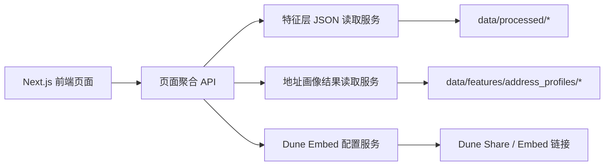
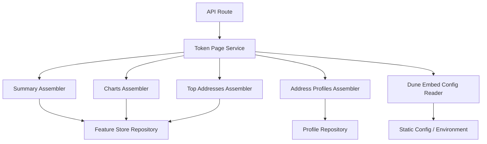
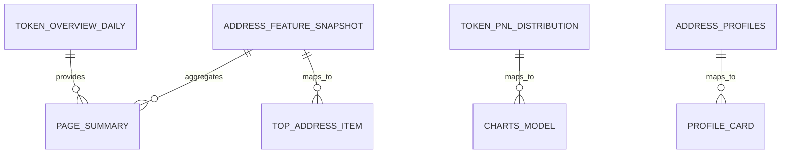

## 1. 架构设计


## 2. 技术描述
- 前端：Next.js + TypeScript + React Server Components
- 样式：Tailwind CSS
- 图表：Recharts 或 ECharts，优先用原生图表承接主叙事
- 数据获取：前端调用只读聚合 API，不直接拼接底层 JSON
- 外部可视化：Dune Share/Embed iframe
- 运行模式：桌面优先单页展示，保留后续扩展多币路由的余量

## 3. 路由定义
| 路由 | 用途 |
|-------|---------|
| / | FET 单币研究展示首页 |
| /loading | 全局加载状态页 |
| /error | 全局错误状态页 |
| /not-found | 兜底未找到状态页 |

## 4. API 定义
```ts
type ApiEnvelope<T> = {
  code: "OK" | "TOKEN_NOT_SUPPORTED" | "DATASET_MISSING" | "DATASET_INVALID" | "INVALID_QUERY_PARAM";
  message: string;
  request_id: string;
  data: T;
  meta: {
    token_symbol: "FET";
    chain_name: "ethereum";
    degraded?: boolean;
  };
};

type TokenPageSummary = {
  token_symbol: "FET";
  token_name: string;
  chain_name: string;
  as_of_date: string;
  token_price_usd: number;
  candidate_address_count: number;
  candidate_net_position_token: number;
  candidate_net_flow_usd: number;
  candidate_avg_net_flow_usd: number;
  avg_buy_price_usd_weighted: number;
  profitable_address_share: number;
  top10_concentration: number;
  research_summary: string;
  risk_highlight: string;
};

type TokenCharts = {
  labels: string[];
  series: {
    price_usd: number[];
    candidate_address_count: number[];
    candidate_net_flow_usd: number[];
    avg_buy_price_usd?: number[];
  };
  pnl_distribution: Array<{
    pnl_bucket: string;
    pnl_bucket_order: number;
    address_count: number;
    address_share: number;
    avg_unrealized_pnl_pct: number;
    median_unrealized_pnl_pct: number;
    total_position_value_usd: number;
    total_unrealized_pnl_usd: number;
    avg_hold_days: number;
  }>;
};

type TopAddressItem = {
  address_key: string;
  as_of_date: string;
  active_days: number;
  first_buy_day: string;
  hold_days_est: number;
  net_position_token: number;
  net_flow_usd: number;
  avg_buy_price_usd: number;
  token_price_usd: number;
  position_cost_usd_est: number;
  position_value_usd: number;
  unrealized_pnl_usd: number;
  unrealized_pnl_pct: number;
  is_stale_snapshot: boolean;
};

type AddressProfileItem = {
  address_key: string;
  as_of_date: string | null;
  profile_label: string;
  risk_note: string;
  summary: string;
  generation_status: "success" | "fallback";
  error_code: string | null;
};

type DuneEmbedItem = {
  title: string;
  description: string;
  embed_url: string;
  open_url: string;
};
```

## 5. 服务架构图


## 6. 数据模型
### 6.1 数据模型定义


### 6.2 数据定义说明
- `token_overview_daily`：提供最新价格、候选地址数、净流入等概览指标与时间序列
- `address_feature_snapshot`：提供地址级快照，用于 Top 地址表与页面聚合计算
- `token_pnl_distribution`：提供收益分桶，用于原生 PnL 分布图
- `address_profiles`：提供 AI 地址标签、摘要与风险提示
- `dune_embed_config`：前端或后端维护的静态配置，提供 FET 对应的 Dune embed URL 与标题说明

## 7. 前端分层约定
- `app/`：页面入口、SEO、错误页与加载页
- `features/`：按业务模块组织 Hero、KPI、Charts、Top Addresses、Profiles、Dune Embed
- `components/`：复用展示组件与基础 UI
- `services/`：请求只读 API
- `types/`：页面模型与 API 类型
- `lib/`：格式化、时间处理、图表配置、状态判断

## 8. 状态与缓存策略
- 首屏采用服务端优先获取，保证页面首屏稳定和作品集展示效果
- 次级模块允许分段加载
- Dune iframe 采用懒加载，不进入视口不加载
- 每个区块单独支持 `loading / empty / error / stale`
- 缓存按页面接口和文件更新时间控制，不做实时推送
