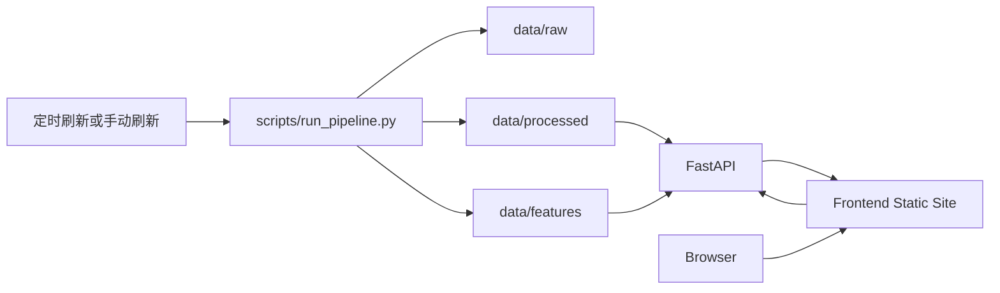

# 部署态工作流说明

## 1. 文档目的

本文档用于说明当前项目在“部署态”下应如何组织工作流。

这里的部署态，不是指已经完成生产级上线，而是指项目开始从“本地演示”过渡到“可发布、可维护、可定时刷新”的阶段。当前项目更适合定位为：

- 作品集展示站
- 研究结果展示站
- 手动或半自动刷新的只读研究平台

## 2. 当前部署态判断

当前仓库已经具备以下条件：

- 已有完整的数据生产链
- 已有可重复执行的本地工作流
- 已有后端聚合 API
- 已有前端研究展示页
- 已有工作流产物校验脚本

但仍缺少以下正式部署要素：

- Dockerfile / docker-compose
- GitHub Actions 部署工作流
- 线上环境变量说明
- 前后端分环境配置
- CORS 白名单
- 定时刷新调度配置
- 部署故障回滚与日志方案

因此，当前更适合采用“轻部署、重展示”的路线，而不是直接进入重型生产架构。

## 3. 部署态系统拆分

部署态建议把系统拆成 3 条链，而不是把所有事情都放在一个进程里。

### 3.1 数据刷新链

职责：

- 渲染 SQL
- 拉取 Dune
- 生成特征层
- 抓取价格快照
- 生成地址画像
- 生成 Token AI 总结
- 校验产物

对应脚本：

- `scripts/run_pipeline.py`
- `scripts/validate_workflow_outputs.py`

产物目录：

- `data/raw/dune/*`
- `data/processed/*`
- `data/features/*`

特点：

- 可以独立运行
- 不依赖前端是否在线
- 可以定时执行
- 单次失败不应该影响上一次已生成的可用产物

### 3.2 页面服务链

职责：

- 从 `data/processed` 和 `data/features` 中读取产物
- 聚合为只读页面模型
- 提供 `/api/v1/tokens/{symbol}/page` 等接口

对应模块：

- `backend/app/main.py`
- `backend/app/services/token_page_service.py`
- `backend/app/api/v1/endpoints/token_display.py`

特点：

- 只读
- 不直接执行数据抓取
- 不依赖 Dune 在线可用
- 不依赖 LLM 在线执行

### 3.3 前端展示链

职责：

- 展示首页、研究页、详细仓位页
- 调用后端只读 API

对应模块：

- `frontend/src/App.tsx`
- `frontend/src/pages/Home.tsx`
- `frontend/src/pages/FetResearch.tsx`
- `frontend/src/pages/TokenPositionsPlaceholder.tsx`

特点：

- 静态资源可单独构建
- 仅依赖后端 API
- 不参与数据生成

## 4. 推荐的部署态工作流

### 4.1 部署前流程

部署前建议按下面顺序执行：

1. 准备 `.env`
2. 运行数据工作流
3. 校验数据产物
4. 启动后端检查 API
5. 构建前端
6. 本地联调验证
7. 再执行部署

推荐命令：

```bash
python scripts/run_pipeline.py
python scripts/validate_workflow_outputs.py
python -m unittest backend.tests.test_token_page_api

cd frontend
npm run check
npm run test
npm run build
```

### 4.2 部署中流程

部署时建议遵循这个顺序：

1. 部署后端 API
2. 验证 `/health`
3. 验证 `/api/v1/tokens/fet/page`
4. 配置前端的 API 地址
5. 部署前端静态站点
6. 人工打开首页和三币页面做最终检查

### 4.3 部署后流程

部署完成后要验证：

- 首页是否能打开
- 三币页面是否可访问
- 第二层 AI 总结是否正常展示
- 第三层地址画像是否正常展示
- 时间是否为北京时间
- 价格快照字段是否正常显示

## 5. 当前最适合的部署模式

当前项目最适合采用“前后端分离 + 数据离线刷新”的轻量模式。

### 5.1 推荐模式

- 前端：静态部署
- 后端：单独部署 FastAPI
- 数据刷新：本地手动触发或定时任务触发

这条路线最符合当前项目特点：

- 页面是展示型，不需要复杂在线写操作
- 数据不是毫秒级实时
- 当前产物已经是 JSON 文件，适合离线生成后再被 API 消费

### 5.2 推荐的阶段性架构



## 6. 推荐的部署阶段划分

### 6.1 阶段一：作品集部署

目标：

- 能对外打开网站
- 能展示三币研究页
- 能稳定读取最近一次生成的数据

特点：

- 允许手动刷新数据
- 允许后端读本地 JSON
- 允许轻量部署方式

### 6.2 阶段二：半自动部署

目标：

- 数据定时刷新
- 页面自动读取新产物
- 部署过程可重复

新增内容：

- 定时任务
- 基础部署脚本
- 线上环境变量配置

### 6.3 阶段三：工程化部署

目标：

- 使用 Docker
- 使用 CI/CD
- 使用更明确的环境划分

新增内容：

- Dockerfile
- docker-compose
- GitHub Actions
- 反向代理或 API 网关

## 7. 当前部署态的关键风险

### 7.1 风险一：前端 API 地址仍偏本地开发风格

当前 Vite 使用本地代理：

- `frontend/vite.config.ts`

这适合开发，但部署后需要改成明确的线上 API 地址方案。

### 7.2 风险二：后端 CORS 仍为全开放

当前：

- `allow_origins=["*"]`

这适合本地联调，不适合正式公网部署。

### 7.3 风险三：数据仍为文件型存储

优点：

- 简单
- 透明
- 演示效率高

限制：

- 不适合更大规模数据
- 不适合并发写入
- 不适合复杂查询

### 7.4 风险四：当前仍缺正式调度层

这意味着：

- 数据刷新仍偏人工
- 工作流失败不会自动告警
- 页面展示可能落后于最新数据

## 8. 推荐的部署态执行原则

- 页面服务和数据刷新必须分离
- 部署前必须先校验工作流产物
- 页面服务只读，不要在线生成 AI
- 数据生成失败时，页面仍应继续读取旧快照
- 线上环境变量必须显式管理，不依赖本地默认值
- 先做轻量部署，再做 Docker 和 CI/CD

## 9. 推荐的当前行动顺序

### 9.1 立即可做

- 更新 README 到真实状态
- 明确前端 API Base URL 方案
- 补部署说明文档

### 9.2 下一步可做

- 增加 GitHub Actions 测试工作流
- 增加定时刷新方案说明
- 增加 Docker 设计文档

### 9.3 后续再做

- Docker 化
- 自动部署
- 更严格的日志与告警

## 10. 一句话总结

当前项目已经适合进入“部署准备阶段”，最合理的路线不是直接重型生产化，而是先采用“前端静态部署 + 后端只读 API + 数据离线刷新”的展示型部署方案，再逐步补齐调度、Docker 和 CI/CD。
