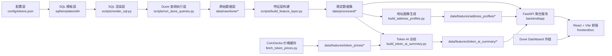

# Onchain Smart Money Lab 项目总结（基于当前仓库审计）

> 审计时间：2026-06-01  
> 项目路径：`d:\aiwork\DprojectsAAA-project-1`  
> 审计方式：基于仓库代码、配置、数据产物、测试结果与现有计划文档进行静态审计；其中后端单元测试已本地执行通过，前端构建与公网部署未在本次审计中实际验证。  
> 项目阶段判断：第一阶段 V1 已形成可演示闭环，当前处于“已实现主链路 + 已有 Demo + 仍需部署化与工程化收口”的状态，而非纯规划阶段。

## 1. 项目概览

### 1.1 项目名称

Onchain Smart Money Lab

### 1.2 项目定位

这是一个面向 Ethereum 生态预设 Token 的链上聪明钱研究与展示项目。项目不是做自动交易，也不是做泛化行情终端，而是把链上研究方法论沉淀为一套可复用的数据链路、AI 解释能力和前端展示页面。

### 1.3 项目目标

- 将原始研究型 SQL 脚本沉淀为统一模板
- 通过配置驱动多 Token 复用分析流程
- 打通 Dune 查询结果到本地结构化数据的主链路
- 提供地址画像与 Token 级 AI 总结
- 用 Web 页面形成作品集级研究展示闭环

### 1.4 解决的问题

- 解决一次性 SQL 研究难复用的问题
- 解决前端、AI 与底层 SQL 口径不统一的问题
- 解决“只有分析结论，没有数据链路与结构化接口”的问题
- 解决链上研究结果难以产品化展示的问题

### 1.5 当前阶段聚焦

当前仓库的真实重心已经从“规划方案”进入“第一阶段 V1 实装”：

- ETH 单链
- 预设 Token：FET、ETH、PEPE
- 手动刷新数据
- Dune 参数化查询
- JSON 文件型特征层
- 地址画像与 Token AI 总结
- FastAPI 聚合 API
- React + Vite 研究展示页与地址详细页

### 1.6 核心价值

- 方法论可复用：配置层 + SQL 模板 + 统一数据接口
- 结果可解释：聚合指标、PnL 分布、地址画像、风险提示
- 展示闭环已形成：数据文件 -> API -> 前端页面
- 适合继续包装为作品集、研究站点或后续产品雏形

### 1.7 关键证据文件

- 项目说明：[README.md](file:///d:/aiwork/DprojectsAAA-project-1/README.md)
- 配置层：[tokens.json](file:///d:/aiwork/DprojectsAAA-project-1/config/tokens.json)
- 后端入口：[main.py](file:///d:/aiwork/DprojectsAAA-project-1/backend/app/main.py)
- API 路由：[token_display.py](file:///d:/aiwork/DprojectsAAA-project-1/backend/app/api/v1/endpoints/token_display.py)
- 页面聚合服务：[token_page_service.py](file:///d:/aiwork/DprojectsAAA-project-1/backend/app/services/token_page_service.py)
- 全流程脚本：[run_pipeline.py](file:///d:/aiwork/DprojectsAAA-project-1/scripts/run_pipeline.py)
- 前端入口：[App.tsx](file:///d:/aiwork/DprojectsAAA-project-1/frontend/src/App.tsx)
- API 调用：[token-page-api.ts](file:///d:/aiwork/DprojectsAAA-project-1/frontend/src/services/token-page-api.ts)
- 前端代理：[vite.config.ts](file:///d:/aiwork/DprojectsAAA-project-1/frontend/vite.config.ts)
- 已产出的数据目录：[data](file:///d:/aiwork/DprojectsAAA-project-1/data)

## 2. 当前项目状态总览

> 说明：以下完成度为基于当前仓库内容的审计估算，不代表正式里程碑验收比例。

| 模块 | 当前状态 | 完成度（审计估算） | 说明 |
| --- | --- | ---: | --- |
| 项目定位与阶段规划 | 已实现 | 90% | 已有 README、plan、docs，但 README 的“当前状态”描述落后于实际代码 |
| Token 配置层 | 已实现 | 90% | 已支持 FET/ETH/PEPE，配置驱动启用、参数、Dune Query ID |
| SQL 模板化 | 已实现 | 90% | 已有 4 个统一模板，且已渲染到 FET/ETH/PEPE |
| Dune 数据接入 | 已实现 | 85% | 已支持更新 Query、执行、轮询、拉取结果、落盘 |
| 特征层 / Processed 层 | 已实现 | 90% | 4 类稳定数据集已生成并落盘 |
| 地址画像 AI | 已实现 | 80% | 已有批量生成器、提示词、输出文件和前端消费 |
| Token 级 AI 总结 | 已实现 | 80% | 已支持结构化输入、LLM 调用、回退逻辑、前端展示 |
| 价格缓存 | 已实现 | 75% | 已接 CoinGecko 并生成 latest/history，但未纳入主 pipeline 步骤 |
| FastAPI 聚合 API | 已实现 | 85% | 已提供 page/summary/charts/top-addresses/address-profiles/dune-embeds |
| 前端展示页 | 已实现 | 85% | 已有首页、二层研究页、三层地址详细页 |
| 测试 | 部分实现 | 65% | 后端 API 测试和前端服务测试已存在；缺少更系统的集成测试 |
| 部署与运维 | 部分实现 | 35% | 本地运行路径清晰，但无 Docker、CI/CD、反向代理、环境分层 |
| 多链 / 实时化 / 账号体系 | 规划中 | 10% | 当前仓库未实现，仍属于后续扩展方向 |

### 2.1 已完成项

- 已完成配置驱动的多 Token 分析入口
- 已完成 4 个 SQL 模板和渲染结果输出
- 已完成 Dune 原始结果落盘到 `data/raw/dune/*`
- 已完成特征层标准化输出到 `data/processed/*`
- 已完成地址画像输出到 `data/features/address_profiles/*`
- 已完成 Token AI 总结输出到 `data/features/token_ai_summary/*`
- 已完成价格缓存输出到 `data/features/token_prices/*`
- 已完成后端聚合 API 与前端页面联通
- 已完成 FET/ETH/PEPE 三个币种的演示数据与页面接入
- 已完成后端单元测试，当前审计中执行 6 项测试全部通过

### 2.2 未完成项

- 未完成公网部署方案与正式发布流程
- 未完成容器化、持续集成、环境分层配置
- 未完成数据库化与缓存服务化，当前仍以 JSON 文件为主
- 未完成实时更新机制，当前是手动刷新
- 未完成多链扩展
- 未完成用户体系、权限、后台管理
- 未完成 Agent / Tool / MCP 级演进，只停留在离线脚本 + API 聚合层
- 未完成文档同步，README 仍偏规划表述

## 3. 整体架构设计



### 3.1 架构分层与职责

| 层级 | 主要职责 | 输入 | 输出 | 当前状态 |
| --- | --- | --- | --- | --- |
| 配置层 | 管理 token 元数据、阈值、Dune Query ID | `config/tokens.json` | 统一 token 配置对象 | 已实现 |
| SQL 模板层 | 统一候选池、成本、校验、PnL SQL 模板 | Token 配置 | 可渲染模板 SQL | 已实现 |
| 数据接入层 | 通过 Dune API 执行参数化查询并落盘 | 模板 SQL、API Key | 原始 JSON 结果 | 已实现 |
| 特征层 | 将原始查询结果标准化为稳定数据集 | 原始 JSON | `token_overview_daily` 等 4 类数据集 | 已实现 |
| AI 层 | 生成地址画像与 Token 总结 | 特征层数据、价格缓存、提示词、LLM | `address_profiles`、`token_ai_summary` | 已实现 |
| API 层 | 聚合概览、图表、地址、画像、Dune 外链 | Processed + Features 数据 | 前端页面模型 | 已实现 |
| 展示层 | 首页、研究页、详细页可视化 | `/api/v1/tokens/{symbol}/page` | 浏览器页面 | 已实现 |
| 运维部署层 | 本地运行、构建、发布、监控 | 环境变量、构建产物 | 线上可用服务 | 部分实现 |

### 3.2 架构判断

- 这是一个“文件型数据中台 + 聚合 API + 展示前端”的轻量架构
- 当前没有引入数据库，处理成本低、演示效率高，但不适合直接承接更大规模数据
- 架构非常适合第一阶段 Demo / 作品集 / 方法论展示
- 如果要进入正式产品阶段，需要补上存储、调度、部署和监控能力

## 4. 模块拆解

### 4.1 配置层

- 职责：统一管理 Token 元信息、阈值、Dune Query ID、是否启用等配置
- 输入：人工维护的 [tokens.json](file:///d:/aiwork/DprojectsAAA-project-1/config/tokens.json)
- 输出：`TokenConfig` 对象，供 SQL 渲染、Dune 执行与 API 层消费
- 连接方式：Python 通过 [config_loader.py](file:///d:/aiwork/DprojectsAAA-project-1/backend/app/services/config_loader.py) 读取
- 当前状态：已实现
- 已知问题：当前配置仍是本地 JSON，缺少环境分层和远程配置管理
- 扩展建议：后续可拆为 `base + env + token registry`，并增加 CLI 级单 token 过滤参数

### 4.2 SQL 模板层

- 职责：把一次性 SQL 改造成可复用模板
- 输入：Token 配置中的 `token_symbol / contract_address / price_contract_address`
- 输出：渲染后的 `sql/rendered/<TOKEN>/*.sql`
- 连接方式：由 [render_sql.py](file:///d:/aiwork/DprojectsAAA-project-1/scripts/render_sql.py) 驱动，底层服务为 [sql_renderer.py](file:///d:/aiwork/DprojectsAAA-project-1/backend/app/services/sql_renderer.py)
- 当前状态：已实现
- 已覆盖模块：
  - `01_token_candidate_pool.sql`
  - `02_token_cost_basis.sql`
  - `03_token_position_validation.sql`
  - `04_token_pnl_snapshot.sql`
- 已知问题：仍然强绑定 ETH 模板目录，尚未抽象多链模板树
- 扩展建议：补上 SQL 输入/输出字段契约自动校验

### 4.3 Dune 数据接入层

- 职责：更新 Dune Query 定义、执行参数化查询、轮询状态、拉取结果并落盘
- 输入：渲染后的 SQL、Dune Query ID、DUNE_API_KEY
- 输出：`data/raw/dune/<TOKEN>/*.json`
- 连接方式：通过 [dune_client.py](file:///d:/aiwork/DprojectsAAA-project-1/backend/app/services/dune_client.py) 访问 Dune REST API
- 当前状态：已实现
- 已知问题：
  - 强依赖 Dune 可用性与网络稳定性
  - 仍使用“更新已有 query_id”的方式，而非自动创建/版本化 Query
- 扩展建议：增加重试、超时分级、失败快照、执行日志归档

### 4.4 特征层

- 职责：把 Dune 原始结果归一化成稳定数据接口
- 输入：`data/raw/dune/*`
- 输出：
  - `token_overview_daily`
  - `address_feature_snapshot`
  - `address_feature_timeline`
  - `token_pnl_distribution`
- 连接方式：由 [build_feature_layer.py](file:///d:/aiwork/DprojectsAAA-project-1/scripts/build_feature_layer.py) 生成到 `data/processed/*`
- 当前状态：已实现
- 已知问题：当前是“轻归一化”，主要做数据映射和落盘，尚未引入更强的字段校验、版本管理与异常处理
- 扩展建议：加入 schema 校验、数据 freshness 校验、字段缺失告警

### 4.5 价格缓存层

- 职责：从 CoinGecko 拉取最新价格与历史桶快照
- 输入：`config/token_prices.json`、COINGECKO_API_KEY
- 输出：
  - `data/features/token_prices/latest.json`
  - `data/features/token_prices/history/*.json`
- 连接方式：由 [fetch_token_prices.py](file:///d:/aiwork/DprojectsAAA-project-1/scripts/fetch_token_prices.py) 调用 CoinGecko
- 当前状态：已实现
- 已知问题：未纳入 [run_pipeline.py](file:///d:/aiwork/DprojectsAAA-project-1/scripts/run_pipeline.py) 主流程
- 扩展建议：将价格缓存设为 AI 总结前置增强步骤，并记录缓存过期时间

### 4.6 地址画像 AI 模块

- 职责：基于地址级快照生成标签、风险提示和摘要
- 输入：`address_feature_snapshot`、提示词、LLM
- 输出：`data/features/address_profiles/<TOKEN>.json`
- 连接方式：由 [build_address_profiles.py](file:///d:/aiwork/DprojectsAAA-project-1/scripts/build_address_profiles.py) 驱动 [address_profile_generator.py](file:///d:/aiwork/DprojectsAAA-project-1/backend/app/services/address_profile_generator.py)
- 当前状态：已实现
- 已知问题：
  - 当前偏离线批量生成，不是在线实时画像
  - 画像标签集合固定，细粒度行为特征仍较少
- 扩展建议：增加规则标签层、缓存复用、增量生成和人工复核标记

### 4.7 Token 级 AI 总结模块

- 职责：对单个 Token 的趋势、市场结构、异动归因和风险做克制型总结
- 输入：`token_overview_daily`、`token_pnl_distribution`、`address_feature_snapshot`、价格缓存
- 输出：`data/features/token_ai_summary/<TOKEN>.json`
- 连接方式：由 [build_token_ai_summary.py](file:///d:/aiwork/DprojectsAAA-project-1/scripts/build_token_ai_summary.py) 驱动 [token_ai_summary_generator.py](file:///d:/aiwork/DprojectsAAA-project-1/backend/app/services/token_ai_summary_generator.py)
- 当前状态：已实现
- 已知问题：
  - 仍是离线生成，不是在线推理
  - 异动归因尚未接入新闻、公告、社媒等链下源
- 扩展建议：后续将“链上结构 + 价格缓存 + 新闻摘要 + 证据评分”整合成更强的归因链

### 4.8 FastAPI 聚合 API

- 职责：把多个 JSON 数据集装配为前端页面模型
- 输入：`data/processed/*`、`data/features/*`
- 输出：只读 API
- 当前接口：
  - `/health`
  - `/api/v1/tokens/{token_symbol}/page`
  - `/api/v1/tokens/{token_symbol}/summary`
  - `/api/v1/tokens/{token_symbol}/charts`
  - `/api/v1/tokens/{token_symbol}/top-addresses`
  - `/api/v1/tokens/{token_symbol}/address-profiles`
  - `/api/v1/tokens/{token_symbol}/dune-embeds`
- 连接方式：入口为 [main.py](file:///d:/aiwork/DprojectsAAA-project-1/backend/app/main.py)，路由为 [router.py](file:///d:/aiwork/DprojectsAAA-project-1/backend/app/api/v1/router.py) 和 [token_display.py](file:///d:/aiwork/DprojectsAAA-project-1/backend/app/api/v1/endpoints/token_display.py)
- 当前状态：已实现
- 已知问题：
  - 当前是文件读取型 API，不带数据库与缓存层
  - CORS 全开放，适合开发期，不适合直接生产
- 扩展建议：增加响应缓存、只读鉴权、分页与过滤策略

### 4.9 前端展示层

- 职责：承接首页、多币种研究页、地址详细页
- 输入：后端 page 聚合 API
- 输出：浏览器展示页面
- 连接方式：Vite 本地通过 `/api` 代理到 `http://127.0.0.1:8000`
- 关键文件：
  - 路由入口：[App.tsx](file:///d:/aiwork/DprojectsAAA-project-1/frontend/src/App.tsx)
  - 页面接口：[token-page-api.ts](file:///d:/aiwork/DprojectsAAA-project-1/frontend/src/services/token-page-api.ts)
  - 研究页：[FetResearchPage.tsx](file:///d:/aiwork/DprojectsAAA-project-1/frontend/src/features/fet-research/FetResearchPage.tsx)
  - 详细页：[TokenPositionsPlaceholder.tsx](file:///d:/aiwork/DprojectsAAA-project-1/frontend/src/pages/TokenPositionsPlaceholder.tsx)
- 当前状态：已实现
- 已知问题：
  - 前端 README 仍是 Vite 模板默认内容
  - 页面文案中大量使用 FET 命名的遗留结构，但实际上已经支持 ETH/PEPE
- 扩展建议：补充真实运行文档、生产构建校验和部署脚本

### 4.10 测试与文档

- 职责：保障 API 正常、记录项目方法与状态
- 输入：代码、计划与数据结构
- 输出：测试用例与文档
- 当前状态：部分实现
- 已实现：
  - 后端测试：[test_token_page_api.py](file:///d:/aiwork/DprojectsAAA-project-1/backend/tests/test_token_page_api.py)
  - 前端服务测试：[token-page-api.test.ts](file:///d:/aiwork/DprojectsAAA-project-1/frontend/src/services/token-page-api.test.ts)
- 已知问题：
  - 缺少 pipeline 测试、E2E 测试、构建测试、部署文档
  - README 状态未同步到当前真实实现
- 扩展建议：加入“数据产物检查 + API 冒烟 + 前端构建”三类自动化校验

## 5. 数据链路与连接方式

```mermaid
flowchart TD
    A[config/tokens.json] --> B[scripts/render_sql.py]
    B --> C[sql/rendered/<TOKEN>/*.sql]
    C --> D[scripts/run_dune_queries.py]
    D --> E[Dune REST API]
    E --> F[data/raw/dune/<TOKEN>/*.json]
    F --> G[scripts/build_feature_layer.py]
    G --> H[data/processed/*]
    H --> I[scripts/build_address_profiles.py]
    H --> J[scripts/build_token_ai_summary.py]
    K[scripts/fetch_token_prices.py] --> L[CoinGecko REST API]
    L --> M[data/features/token_prices/*]
    M --> J
    I --> N[data/features/address_profiles/*]
    J --> O[data/features/token_ai_summary/*]
    H --> P[FastAPI /api/v1/tokens/{symbol}/page]
    N --> P
    O --> P
    P --> Q[React 页面]
    R[Dune Dashboard 外链] --> Q
```

### 5.1 数据旅程

1. 在 `config/tokens.json` 中定义目标 Token、阈值和 Dune Query ID  
2. 使用 `scripts/render_sql.py` 按 Token 渲染统一 SQL 模板  
3. 使用 `scripts/run_dune_queries.py` 更新 Dune 查询定义并拉取执行结果  
4. 将原始结果落盘到 `data/raw/dune/<TOKEN>/`  
5. 用 `scripts/build_feature_layer.py` 归一化为 4 个稳定数据集  
6. 用 `scripts/build_address_profiles.py` 生成地址画像  
7. 用 `scripts/build_token_ai_summary.py` 生成 Token 级 AI 总结  
8. 可选执行 `scripts/fetch_token_prices.py` 获取最新价格缓存  
9. FastAPI 聚合 `processed + features` 输出页面级 JSON  
10. 前端通过 `/api/v1/tokens/{symbol}/page` 获取完整页面模型并渲染  

### 5.2 脚本连接关系

| 脚本 | 作用 | 输入 | 输出 | 当前状态 |
| --- | --- | --- | --- | --- |
| `scripts/render_sql.py` | 渲染模板 SQL | `tokens.json` | `sql/rendered/*` | 已实现 |
| `scripts/run_dune_queries.py` | 调用 Dune 并落盘 | 渲染 SQL、Dune API | `data/raw/dune/*` | 已实现 |
| `scripts/build_feature_layer.py` | 生成稳定数据集 | `data/raw/dune/*` | `data/processed/*` | 已实现 |
| `scripts/build_address_profiles.py` | 生成地址画像 | `address_feature_snapshot`、LLM | `data/features/address_profiles/*` | 已实现 |
| `scripts/build_token_ai_summary.py` | 生成 Token 总结 | processed 数据、价格缓存、LLM | `data/features/token_ai_summary/*` | 已实现 |
| `scripts/fetch_token_prices.py` | 拉取价格缓存 | CoinGecko 配置 | `data/features/token_prices/*` | 已实现 |
| `scripts/run_pipeline.py` | 串联主流程 | 上述脚本 | 一键产出主链路结果 | 已实现 |

### 5.3 连接方式总表

| 连接对象 | 连接方式 | 用途 | 当前状态 |
| --- | --- | --- | --- |
| Dune | REST API + Query PATCH/POST/GET | 获取链上研究原始结果 | 已实现 |
| CoinGecko | REST API | 获取价格缓存 | 已实现 |
| DeepSeek | Chat Completions API | 生成地址画像与 Token 总结 | 已实现 |
| 本地文件系统 | JSON 文件读写 | 存储原始、处理后和 AI 结果 | 已实现 |
| FastAPI -> React | HTTP JSON API | 页面聚合数据输出 | 已实现 |
| 前端 -> Dune | 外链跳转 | 研究证明层 | 部分实现 |

### 5.4 当前数据存储方式判断

- 当前无数据库，核心存储媒介是 JSON 文件
- 这让 Demo 非常轻量，也让数据审阅与调试更直接
- 但它带来的问题是：
  - 并发读写能力有限
  - 缺少索引、查询与历史版本管理
  - 不适合后续持续增量与更大数据量

## 6. 前后端与展示方式

### 6.1 前端当前状态

- 首页已实现，用于币种入口选择
- 二层研究页已实现，展示核心指标、趋势图、PnL 结构、Top 地址预览、Dune 外链、方法说明
- 三层详细页已实现，展示更多地址明细和地址画像摘要
- 当前前端已经不是“骨架”，而是一个可演示的多页路由 Demo

### 6.2 后端当前状态

- FastAPI 已实现健康检查和多种只读聚合接口
- API 的数据来源不是数据库，而是 `data/processed` 与 `data/features`
- 聚合逻辑集中在 [token_page_service.py](file:///d:/aiwork/DprojectsAAA-project-1/backend/app/services/token_page_service.py)
- 所有时间最终统一转换为北京时间输出

### 6.3 本地运行方式

后端：

```bash
uvicorn backend.app.main:app --reload
```

前端：

```bash
cd frontend
npm install
npm run dev
```

数据主流程：

```bash
python scripts/run_pipeline.py
```

价格缓存增强流程：

```bash
python scripts/fetch_token_prices.py
```

### 6.4 本地连接闭环

- 前端通过 [vite.config.ts](file:///d:/aiwork/DprojectsAAA-project-1/frontend/vite.config.ts) 把 `/api` 代理到 `http://127.0.0.1:8000`
- 浏览器访问前端开发服务器
- 前端读取 `/api/v1/tokens/{symbol}/page`
- 后端从本地 JSON 数据集装配页面模型
- 页面最终渲染图表、摘要、地址表和 AI 输出

### 6.5 从 localhost 到公网部署的路径

当前仓库尚未提供现成公网部署脚本，但可按以下方式推进：

1. 后端使用 `uvicorn/gunicorn + reverse proxy` 部署为只读 API  
2. 前端执行 `npm run build` 产出静态资源  
3. 用 Nginx 或平台静态托管承载前端  
4. 将 `/api` 反向代理到 FastAPI 服务  
5. 使用环境变量注入 `DUNE_API_KEY / DEEPSEEK_API_KEY / COINGECKO_API_KEY`  
6. 把数据更新脚本做成定时任务或 CI 调度  

### 6.6 部署准备度评估

| 维度 | 准备度 | 说明 |
| --- | --- | --- |
| 本地开发运行 | 高 | 路径清晰，前后端职责明确 |
| 本地演示闭环 | 高 | 数据、API、页面已打通 |
| 生产构建文档 | 低 | 缺少正式构建与发布说明 |
| 容器化 | 低 | 未发现 Dockerfile / docker-compose |
| CI/CD | 低 | 未发现工作流配置 |
| 环境隔离 | 中 | 有 `.env.example`，但无 dev/staging/prod 分层 |
| 线上观测 | 低 | 无监控、日志收集、告警配置 |
| 数据调度 | 中低 | 有脚本但无正式调度编排 |

## 7. AI 能力设计

### 7.1 AI 在系统中的角色

当前 AI 不是主数据源，而是解释层：

- 地址画像：解释地址行为风格
- Token 总结：解释趋势、结构、风险与谨慎归因

这意味着项目的核心可信度仍来自结构化数据，而不是模型主观判断。

### 7.2 已实现能力

| AI 能力 | 输入 | 输出 | 状态 |
| --- | --- | --- | --- |
| 地址画像 | `address_feature_snapshot` | `profile_label / risk_note / summary` | 已实现 |
| Token 级总结 | overview + pnl + snapshot + price cache | `trend_summary / market_context / event_attribution / risk_warning / confidence` | 已实现 |

### 7.3 依赖项

- LLM Provider：当前仅支持 DeepSeek
- Prompt 文件：
  - [address_profile_prompt.md](file:///d:/aiwork/DprojectsAAA-project-1/prompts/address_profile/address_profile_prompt.md)
  - [style_control_prompt.md](file:///d:/aiwork/DprojectsAAA-project-1/prompts/token_summary/style_control_prompt.md)
  - [event_attribution_prompt.md](file:///d:/aiwork/DprojectsAAA-project-1/prompts/token_summary/event_attribution_prompt.md)
  - [risk_warning_prompt.md](file:///d:/aiwork/DprojectsAAA-project-1/prompts/token_summary/risk_warning_prompt.md)
- 环境变量：`DEEPSEEK_API_KEY`

### 7.4 输出边界控制

- 对地址画像限制标签集合
- 对 Token 总结限制输出字段
- 对内容做越界词过滤，例如禁止直接给出买卖建议、内幕判断等
- 当模型异常时，使用 fallback 文本保障结果稳定落盘

### 7.5 向 Agent / Tool / MCP 演进的可行路径

当前状态仍是“离线批处理 AI + 页面消费”，还不是 Agent 系统。

要继续演进，需要补齐：

- Tool 化：把 Dune 查询、价格抓取、画像生成、摘要生成封装为可调用工具
- Agent 编排：让 AI 依据任务自动选择查询、摘要、比对与证据链输出
- MCP 化：将数据查询与结果检索能力包装成标准服务接口

建议起点：

1. 先把 `build_address_profiles` 和 `build_token_ai_summary` 封成可复用 API  
2. 再把“读取 processed/features 数据”的能力抽成统一工具层  
3. 最后再考虑接入会话式 Agent 或 MCP Server  

## 8. 技术决策与方法说明

### 8.1 采用配置驱动而非硬编码多币逻辑

- 原因：减少新增 Token 的代码改动面
- 好处：渲染 SQL、Dune 查询、页面入口保持统一
- 限制：仍需要人工维护配置与 Query ID

### 8.2 采用文件型特征层而非数据库

- 原因：第一阶段强调可演示、可迁移、低门槛
- 好处：简单直观，适合作品集与研究项目
- 限制：不利于大规模查询、增量更新与并发访问

### 8.3 采用 FastAPI 做“聚合 API”而不是前端直读数据文件

- 原因：避免 API Key 暴露，隔离前端与数据结构变化
- 好处：前端只消费页面模型，后续可替换底层存储
- 限制：当前 API 仍是只读文件装配，尚未形成更完整服务层

### 8.4 采用离线 AI 生成而不是在线实时推理

- 原因：降低调用成本，稳定页面首屏体验
- 好处：输出可控，失败可回退，适合静态展示
- 限制：内容时效性依赖更新任务，不适合实时研究场景

### 8.5 采用 Dune 作为链上研究来源而不是自建索引

- 原因：第一阶段更重方法与结果，不重基础设施重建
- 好处：开发成本低，能快速验证分析逻辑
- 限制：对外部平台依赖强，性能与可用性不可完全控制

### 8.6 采用“页面模型”而不是前端多接口拼装

- 原因：降低前端复杂度，统一口径
- 好处：`/page` 一次返回 summary/charts/top_addresses/address_profiles/dune_embeds
- 限制：当页面增长时，单接口可能变重，需要拆分或缓存

## 9. 当前问题、风险与待确认项

### 9.1 当前问题

- `README.md` 与 `plan/project_status_2026-05-30_164711.md` 对当前状态的描述已落后于真实代码
- 前端 `README.md` 仍是默认 Vite 模板，没有真实项目运行说明
- `run_pipeline.py` 未包含 `fetch_token_prices.py`，价格缓存与 AI 总结的关系未完全显式化
- 前端命名中仍保留 `fet-research` 目录名，但功能已扩展到 ETH/PEPE

### 9.2 主要技术风险

| 风险类型 | 风险说明 | 影响 |
| --- | --- | --- |
| 数据口径风险 | Dune 查询结果、价格缓存时间、AI 摘要时间不完全同源 | 可能导致页面时间不一致 |
| 外部依赖风险 | Dune、CoinGecko、DeepSeek 任一异常都可能影响刷新链路 | 刷新失败或内容降级 |
| 架构耦合风险 | API 直接依赖本地 JSON 目录结构 | 目录变更会影响服务 |
| 工程化风险 | 缺少容器化、CI/CD、环境分层 | 不利于上线与协作 |
| AI 风险 | 输出虽有限制，但仍需人工校验内容质量 | 可能出现保守但不够有用的摘要 |

### 9.3 待确认项

- 线上部署目标平台当前材料中未体现
- 数据刷新频率仅从脚本推断为手动/定时可扩展，正式调度方案未体现
- 前端生产构建是否已实际验证，当前材料中未体现
- 是否计划引入数据库、消息队列或缓存服务，当前材料中未体现

### 9.4 建议补充材料

- 一份真实的运行说明文档
- 一份部署说明文档
- 一份数据更新时间与口径说明
- 一份生产环境变量说明
- 一份前后端联调与发布清单

## 10. 未来扩展路线图

### Phase A：文档与部署收口

- 目标：让项目从“能运行”提升到“可交付”
- 关键工作：
  - 更新 README 和前端 README
  - 增加部署说明与发布清单
  - 增加构建校验与基础 CI
- 交付物：统一说明文档、构建通过、发布路径清晰
- 风险：文档补齐后若代码继续快速演进，仍需同步维护

### Phase B：数据与任务调度稳定化

- 目标：让数据刷新不再依赖纯人工串行操作
- 关键工作：
  - 将价格抓取纳入主 pipeline
  - 增加任务重试、日志和 freshness 检查
  - 为数据产物增加 schema 校验
- 交付物：更稳定的每日/定时数据产出
- 风险：外部 API 波动仍会影响任务成功率

### Phase C：API 与存储升级

- 目标：从文件型 Demo 走向更稳的服务架构
- 关键工作：
  - 引入数据库或对象存储索引层
  - 为 API 增加缓存与分页
  - 增加地址详情与时间序列接口
- 交付物：更适合持续运行与扩展的数据服务
- 风险：工程复杂度显著上升

### Phase D：AI 能力增强

- 目标：从离线解释走向更强证据链总结
- 关键工作：
  - 引入新闻/公告/社媒摘要
  - 做事件归因证据评分
  - 支持增量画像更新
- 交付物：更强的 Token 总结与事件解释能力
- 风险：AI 成本、事实边界和提示词维护复杂度增加

### Phase E：产品化与 Agent 化

- 目标：从展示站走向研究工作台
- 关键工作：
  - 增加筛选、对比、搜索、收藏
  - 抽象工具层与 Agent 编排层
  - 评估 MCP 输出能力
- 交付物：研究助手式产品原型
- 风险：范围膨胀，需要先稳住数据与服务基础

## 11. 最终总结

### 11.1 项目优势

- 数据主链路已经真实打通，不再停留在规划层
- 多币种、多页面、AI 输出、API 聚合都已有落地实现
- 仓库中已存在真实数据产物，说明不是空壳展示项目
- 后端测试已通过，说明至少核心页面 API 可正常装配

### 11.2 项目短板

- 工程化和部署能力明显落后于功能实现
- 文档状态落后，容易让后来者低估当前已实现程度
- 当前仍是文件型架构，后续扩展空间有限
- AI 能力已接入，但仍偏离线生成，距离实时研究助手还有距离

### 11.3 项目类型判断

当前更准确的项目类型是：

“已完成第一阶段核心闭环、具备作品集展示价值的链上研究 Demo / V1 原型”，而不是“仍在纯规划期的半成品”。

### 11.4 适合的包装方式

- 作品集：强调“SQL 模板化 + 特征层 + AI 解释 + Web 展示”
- 面试项目：强调“从链上数据研究到产品化展示”的完整闭环
- 产品方向：强调“可扩展的链上研究工作台雏形”

### 11.5 最值得优先推进的 3 件事

1. 同步更新文档，让仓库状态与真实代码一致  
2. 补齐部署与构建链路，让项目可稳定公开访问  
3. 把数据刷新与价格缓存纳入统一调度，提高结果稳定性  

## 12. 推荐行动清单

| 优先级 | 动作 | 目标 | 预期收益 |
| --- | --- | --- | --- |
| P0 | 更新根 README 与前端 README | 反映真实实现状态 | 降低理解成本，便于交付 |
| P0 | 增加部署说明与环境变量说明 | 支撑本地到公网迁移 | 提升部署准备度 |
| P0 | 将 `fetch_token_prices.py` 纳入主流程或定时任务 | 统一 AI 输入时效 | 减少价格与快照时间差 |
| P1 | 增加前端构建校验、后端启动检查、数据 freshness 检查 | 提高发布稳定性 | 降低演示和上线风险 |
| P1 | 增加 schema 校验与 pipeline 冒烟测试 | 提高数据可靠性 | 防止上游结果变形 |
| P1 | 收敛目录命名与页面文案中的 FET 遗留命名 | 统一多币种表达 | 提升项目专业度 |
| P2 | 引入容器化与 CI/CD | 提升工程化能力 | 便于长期维护 |
| P2 | 规划数据库/缓存替代文件型存储 | 为后续扩展做准备 | 支撑更强产品化 |
| P2 | 设计 Tool/Agent/MCP 演进路线 | 提前抽象 AI 工具层 | 为下一阶段升级铺路 |

## 附录：本次审计的关键事实

- 已存在原始 Dune 结果：`data/raw/dune/ETH|FET|PEPE/*.json`
- 已存在处理后数据：`data/processed/*/{ETH,FET,PEPE}.json`
- 已存在 AI 画像与 Token 总结结果：`data/features/address_profiles/*`、`data/features/token_ai_summary/*`
- 已存在价格缓存：`data/features/token_prices/latest.json`
- 后端 API 测试已通过 6 项
- 未发现 Dockerfile、docker-compose、CI 工作流、Vercel/Netlify/Procfile 等正式部署文件
