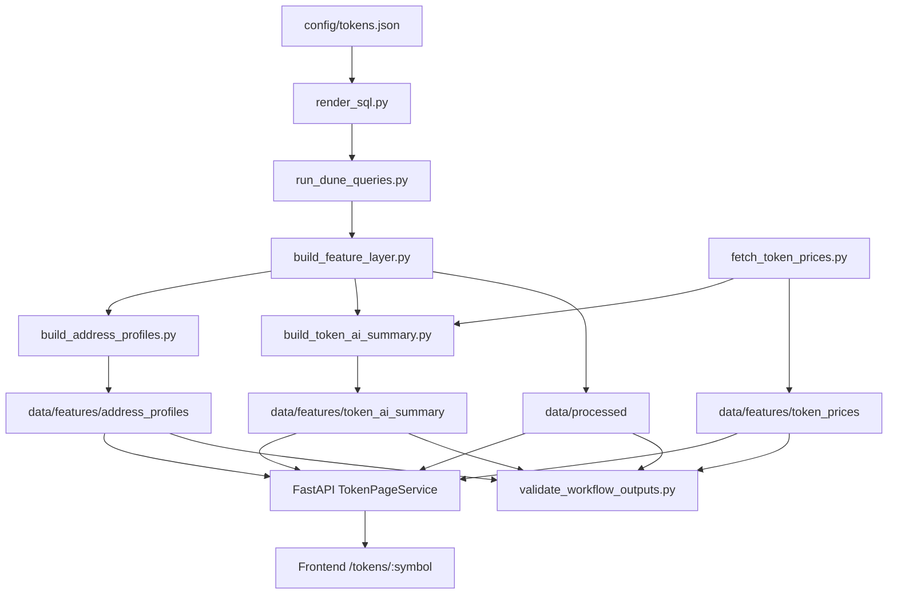

# 工作流搭建与成熟化说明

## 1. 文档目的

本文档用于说明当前项目的数据工作流、服务工作流和后续成熟化方向。

目标不是把项目一次性做成重型平台，而是在现有展示型项目基础上，把链路整理成：

- 可重复执行
- 可局部跳过
- 可校验结果
- 可继续接入定时任务
- 可为部署做准备

## 2. 当前工作流目标

当前项目的核心链路已经从“零散脚本”收敛为一条明确的本地工作流：

1. 渲染 SQL
2. 拉取 Dune 结果
3. 生成特征层
4. 抓取价格快照
5. 生成地址画像
6. 生成 Token AI 总结
7. 校验工作流产物

这条链路对应的设计原则是：

- 数据生产和页面消费分离
- API 只消费标准化产物，不直接参与数据生成
- AI 输出依赖特征层和价格快照，不直接读取原始 SQL
- 每次刷新结束后必须有校验步骤

## 3. 当前工作流结构

### 3.1 主工作流脚本

当前统一入口：

- `scripts/run_pipeline.py`

当前支持的步骤标识：

- `render_sql`
- `run_dune_queries`
- `build_feature_layer`
- `fetch_token_prices`
- `build_address_profiles`
- `build_token_ai_summary`
- `validate_outputs`

支持跳过任意步骤，例如：

```bash
python scripts/run_pipeline.py --skip-steps run_dune_queries
```

如果本地已经有最新的 Dune 原始结果，但想重建后续产物，可以使用：

```bash
python scripts/run_pipeline.py --skip-steps run_dune_queries
```

如果只想检查现有产物是否完整，可以直接运行：

```bash
python scripts/validate_workflow_outputs.py
```

### 3.2 工作流阶段图



## 4. 各步骤说明

### 4.1 Step 1: 渲染 SQL

脚本：

- `scripts/render_sql.py`

输入：

- `config/tokens.json`
- `sql/templates/eth/*.sql`

输出：

- `sql/rendered/<TOKEN>/*.sql`

作用：

- 把模板 SQL 渲染成每个 token 可执行的查询文本
- 让 SQL 层维持统一模板，而不是保留多份手写脚本

### 4.2 Step 2: 拉取 Dune 结果

脚本：

- `scripts/run_dune_queries.py`

输入：

- `.env` 中的 Dune 配置
- `config/tokens.json`
- `sql/templates/eth/*.sql`

输出：

- `data/raw/dune/<TOKEN>/*.json`

作用：

- 对每个启用 token 执行 Dune 参数化查询
- 将结果存为原始快照，供后续特征层统一消费

### 4.3 Step 3: 生成特征层

脚本：

- `scripts/build_feature_layer.py`

输入：

- `data/raw/dune/<TOKEN>/*.json`

输出：

- `data/processed/token_overview_daily/<TOKEN>.json`
- `data/processed/address_feature_snapshot/<TOKEN>.json`
- `data/processed/address_feature_timeline/<TOKEN>.json`
- `data/processed/token_pnl_distribution/<TOKEN>.json`

作用：

- 把原始 Dune 结果标准化为前端和 AI 共用的数据集
- 作为整个系统的数据契约中枢

### 4.4 Step 4: 抓取价格快照

脚本：

- `scripts/fetch_token_prices.py`

输入：

- `.env` 中的 CoinGecko 配置
- `config/token_prices.json`

输出：

- `data/features/token_prices/latest.json`
- `data/features/token_prices/history/<TOKEN>.json`

作用：

- 为页面展示和 Token AI 总结提供价格缓存
- 避免每次打开页面都调用外部 API

### 4.5 Step 5: 生成地址画像

脚本：

- `scripts/build_address_profiles.py`

输入：

- `data/processed/address_feature_snapshot/<TOKEN>.json`
- `prompts/address_profile/address_profile_prompt.md`
- `.env` 中的 DeepSeek 配置

输出：

- `data/features/address_profiles/<TOKEN>.json`

作用：

- 为第三层详细页提供结构化地址画像
- 保持输出 JSON 稳定，单条失败不影响整体

### 4.6 Step 6: 生成 Token AI 总结

脚本：

- `scripts/build_token_ai_summary.py`

输入：

- `data/processed/token_overview_daily/<TOKEN>.json`
- `data/processed/token_pnl_distribution/<TOKEN>.json`
- `data/processed/address_feature_snapshot/<TOKEN>.json`
- `data/features/token_prices/latest.json`
- `prompts/token_summary/*.md`
- `.env` 中的 DeepSeek 配置

输出：

- `data/features/token_ai_summary/<TOKEN>.json`

作用：

- 为第二层研究页提供 token 级总结
- 将价格快照与链上特征组合成可解释的研究描述

### 4.7 Step 7: 校验工作流产物

脚本：

- `scripts/validate_workflow_outputs.py`

当前校验范围：

- 每个启用 token 的 `processed` 数据集是否存在
- 每个启用 token 的 `address_profiles` 是否存在且有 `rows`
- 每个启用 token 的 `token_ai_summary` 是否存在且有关键字段
- `token_prices/latest.json` 是否覆盖所有启用 token

作用：

- 把“刷新结束”变成“刷新并确认结果可用”
- 避免页面启动后才发现产物缺失

## 5. 当前工作流成熟度

### 5.1 已完成

- 已有统一主入口 `run_pipeline.py`
- 已将价格抓取并入主工作流
- 已有工作流产物校验脚本
- 已有数据访问抽象，路径不再在 API 和脚本中大量硬编码
- 已有三币共用的后端 API 和前端页面消费链路

### 5.2 仍未完成

- 还没有正式定时调度层
- 还没有 GitHub Actions 或系统级 cron 配置
- 还没有 Docker 化运行说明
- 还没有部署态的日志归集与告警
- README 还没有完全同步到当前真实状态

## 6. 推荐的本地使用流程

### 6.1 全量刷新

```bash
python scripts/run_pipeline.py
```

适合场景：

- 新一轮研究数据刷新
- 重新生成全部产物
- 交付前统一校验

### 6.2 跳过 Dune，重建后续结果

```bash
python scripts/run_pipeline.py --skip-steps run_dune_queries
```

适合场景：

- Dune 原始数据已存在
- 只想重建特征层、AI 输出和价格层

### 6.3 仅做产物校验

```bash
python scripts/validate_workflow_outputs.py
```

适合场景：

- 启动 API 前快速检查
- 部署前检查数据完整性

## 7. 推荐的后续成熟化路线

### 7.1 第一优先级

- 增加 `refresh_all.ps1` 或 `Makefile` 风格入口
- 把 README 更新到当前真实工作流
- 补一份部署运行说明

### 7.2 第二优先级

- 接入 GitHub Actions：
  - `test.yml`
  - `validate-data.yml`
- 增加定时刷新任务方案说明：
  - GitHub Actions 定时
  - 本地 Task Scheduler
  - Linux cron

### 7.3 第三优先级

- Docker 化：
  - 后端 API 容器
  - 前端静态构建容器
  - 数据刷新 job 容器
- 将“数据刷新工作流”和“页面服务工作流”完全拆开

## 8. 推荐的未来系统工作流

未来成熟形态建议拆为 4 条链：

### 8.1 数据生产链

- SQL 渲染
- Dune 查询
- 特征层标准化

### 8.2 AI 增强链

- 地址画像
- Token AI 总结
- 价格缓存融合

### 8.3 服务消费链

- FastAPI 聚合页面模型
- 前端研究页和详细页消费 API

### 8.4 发布运维链

- 测试
- 产物校验
- 定时刷新
- 部署

## 9. 当前最推荐的执行原则

- 页面服务只读，不负责生成数据
- 每次刷新必须带校验
- 价格快照必须作为 AI 总结的正式输入
- 工作流步骤要支持跳过，便于本地调试
- 新增 token 时优先改配置，不优先改业务逻辑

## 10. 一句话总结

当前项目已经从“散装脚本集合”升级为“可编排、可校验、可继续接入调度层的本地研究工作流”，下一步重点应放在定时任务、部署说明和 Docker 化，而不是继续堆积新的业务功能。
